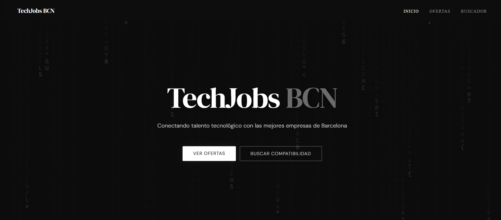
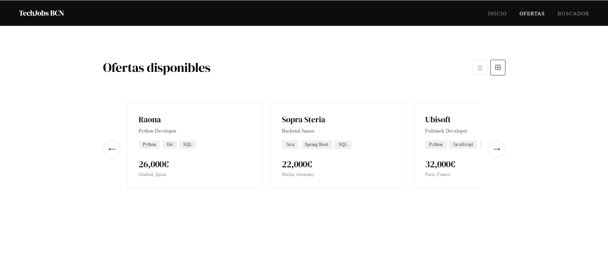
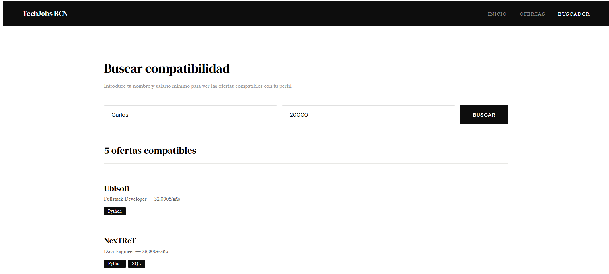

# TechJobs BCN

Plataforma web que conecta programadores con empresas tecnológicas. Los programadores pueden explorar ofertas de empleo y descubrir su compatibilidad con cada posición según sus conocimientos técnicos y salario mínimo deseado.



## Stack tecnológico

**Frontend**
- Angular 21 + TypeScript
- SCSS
- Angular Router
- Signals (reactividad moderna)

**Backend**
- Python + Flask
- SQLite
- Flask-CORS
- REST API

## Funcionalidades

- Listado de ofertas en vista lista o carrusel de tarjetas
- Buscador de compatibilidad por perfil técnico y salario mínimo
- API REST con Flask que conecta frontend y base de datos
- Verificación de países via API externa (restcountries.com)

## Capturas

### Página de inicio


### Ofertas — vista lista


### Ofertas — vista tarjetas


### Buscador de compatibilidad


## Cómo ejecutarlo localmente

### Backend
```bash
cd backend
pip install flask flask-cors
python app.py
```
El servidor arranca en `http://localhost:5000`

### Frontend
```bash
cd frontend
npm install
ng serve
```
La app arranca en `http://localhost:4200`

## Estructura del proyecto
```
TechJobsBCN/
├── backend/          # API Flask + SQLite
│   ├── app.py        # Rutas de la API
│   ├── bolsa.py      # Clases del dominio
│   ├── database.py   # Capa de persistencia
│   └── api.py        # Integración con APIs externas
└── frontend/         # App Angular
    └── src/app/
        ├── bienvenida/
        ├── lista-ofertas/
        ├── buscador/
        ├── models/
        └── services/
```

## Autor

Santiago Nakakawa — Ingeniero en Sistemas Computacionales  
Barcelona, España  
[GitHub](https://github.com/Naka3107)
